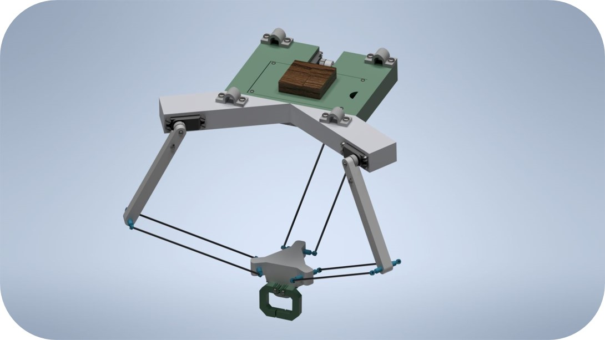
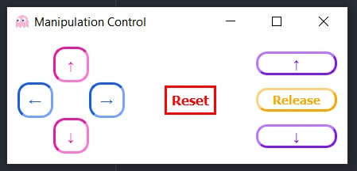
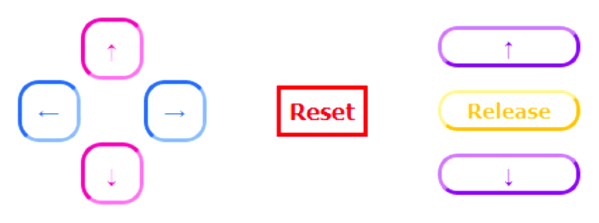

# Grab control console

For the module like this:  
  
I've created a simple console with UI to control it:  
Python code written using PyQt5, PySerial  
  
> Additionaly includes code for arduino with logic to calculate position written using MultiServo library.   

## Demonstration of UI elements  
  
